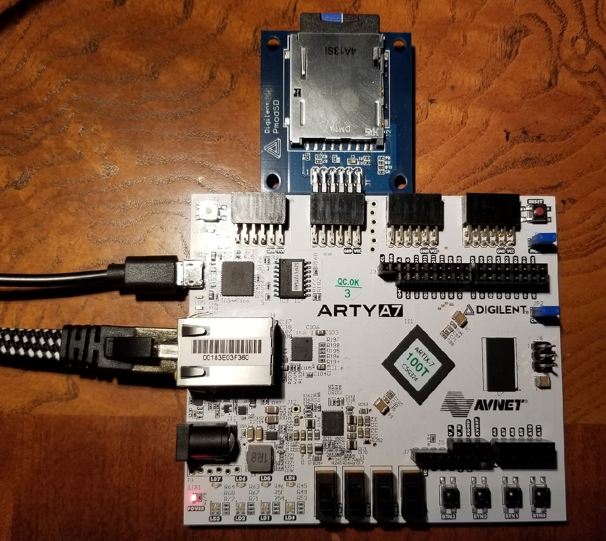

# Arty A7 100T
Arty A7 board does not have SD card slot.
The workaround is to use [Pmod SD adapter](https://digilent.com/shop/pmod-sd-full-sized-sd-card-slot/):

Note that the adapter is expected on JB connector.
